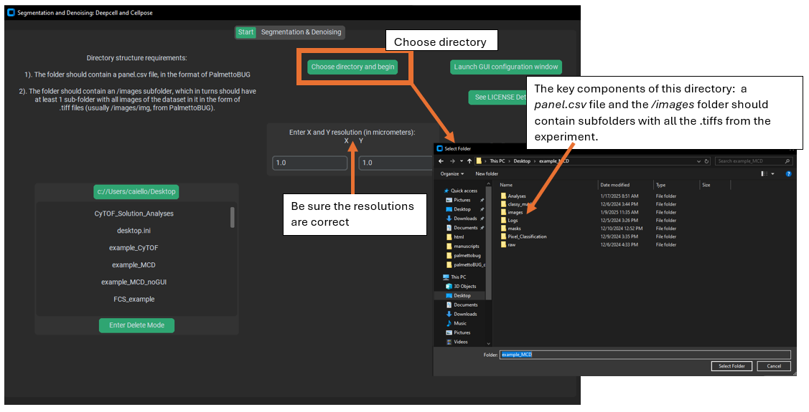
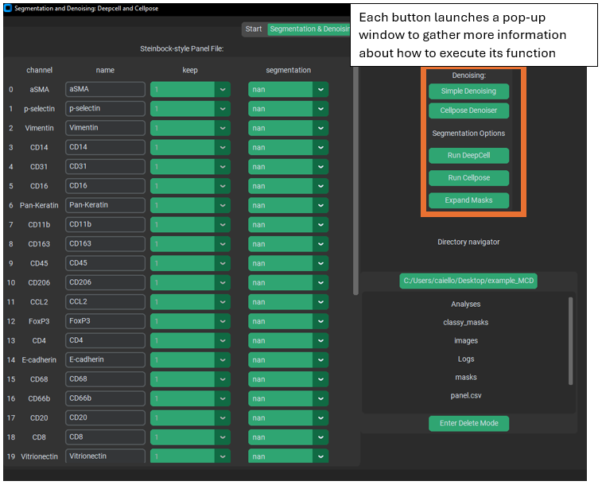

Loading Data in isoSegDenoise separately from PalmettoBUG
=========================================================

While the typical use of isosegdenoise is an a sub-program of
PalmettoBUG, the isosegdenoise GUI can be launched separately, and also load
data separately.

Note: even though isosegdenoise can be used separately from PalmettoBUG,
it expects the data / directory structures created by PalmettoBUG, and
does not perform these steps (such as converting MCDs 🡪 TIFFs in raw) on
its own. Because of this, it is rare to launch isoSegDenoise 
separately from the PalmettoBUG interface.

Launch:
~~~~~~~

In the terminal (usually miniconda prompt in the environment where
isosegdenoise is installed), type:

>>> segdenoise

This will launch the program automatically (without loading any data). 
Tags can be added to this command to direct it to an existing PalmettoBUg-style 
directory, and to provide the X (r1) and Y (r2) resolutions of the images:

>>> segdenoise -d "/Path/to/the/directory" -r1 1.0 -r2 1.0

A command like this is also how PalmettoBUG launches iSD into a project.

Alternatively, you can launch the program from inside a Python session:

   >>> import isosegdenoise as isd 
   >>> isd.run_GUI(directory = None, resolutions = [1.0, 1.0])

The majority of the delay in the program launching is a consequence of the first line (import isosegdenoise),
likely because of the number of dependencies that need to be loaded. Therefore, if you close the program
but leave the python session open, then re-launching the program with a second call to isd.run_GUI() will be
MUCH faster in opening the program.

Loading data:
~~~~~~~~~~~~~

Once in the opening screen of the program:

|A screenshot of a computer Description automatically generated|

Note that unlike PalmettoBUG, this program only interacts with the
images and masks folders (and their subfolders of images), as well as
the panel file. The panel file and images (as .tiff files in a subfolder
of */images*) must be present when loading the directory. Other folders
may or may not be present when you load the directory, but these are the
minimum needed to do isosegdenoise functions.

.. note::
   
   isoSegDenoise does NOT perform the initial steps of converting MCD files to TIFF files
   or setting up a panel file! It expects the panel file to already exist (whether made manually
   of in PalmettoBUG), and the /images/ folder to already contain subfolders of TIFF files!

Performing Denoising & Segmentation
~~~~~~~~~~~~~~~~~~~~~~~~~~~~~~~~~~~

|image1|

Once the directory is loaded, make sure the panel file is
up to date and reflects your desired choices. *It can be particularly
easy to forget to set your segmentation markers when transitioning from PalmettoBUG,
since you will not have needed to set those before launching iSD!*

Then use the buttons in the upper right corner to launch pop-up windows
in order to do the described functions. These pop-up windows ask for
information like, *Which folder of images are you denoising? Which
folder do you want to write the denoised images to? What parameters for
the denoising algorithm?* Etc. 
The set up and behaviour of the GUI for iSD is generally very similar 
to PalmettoBUG's GUI behaviour (and much of the code was originally shared).

If you click on a button and a window doesn’t show up immediately, it
might be that the window opened behind other programs open on your
computer. You can click the same button again as a shortcut to bring
that window to the front *(as a rule, clicking a second time on a button in this
program / PalmettoBUG will not open an additional pop-up window if the old window still exists, but
instead will try to bring the existing window to the foreground on your screen)*.

